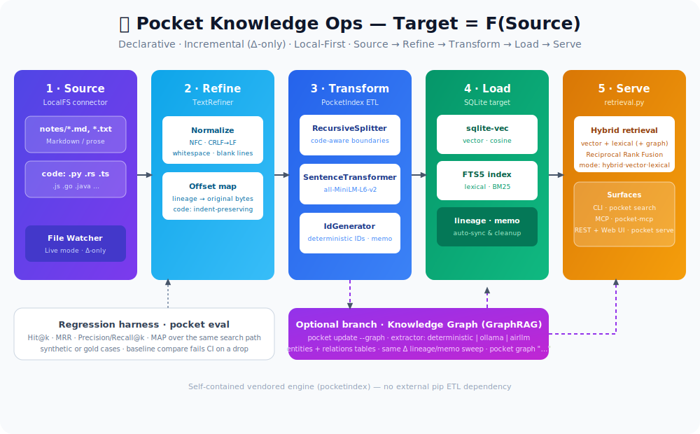
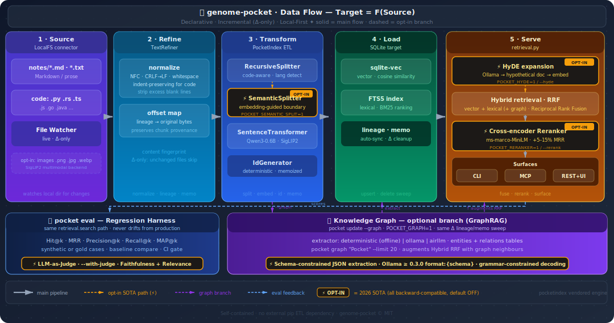
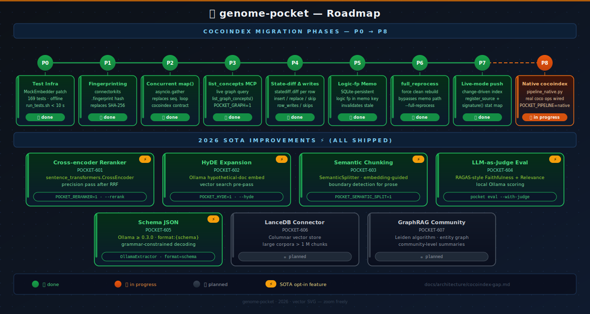

# genome-pocket 🧬

[](https://opensource.org/licenses/MIT)
[](https://www.python.org/downloads/)
[](#-concept--architecture)
[](https://github.com/asg017/sqlite-vec)

Sequence your knowledge. Carry the whole map in your pocket.

**Pocket Knowledge Ops** is a local-first personal knowledge runtime powered by the **PocketIndex** declarative incremental ETL paradigm (an in-tree vendored engine inspired by CocoIndex's Source→Refine→Load→Serve model). It watches your local markdown notes, chunks them, generates vector embeddings using a local SentenceTransformer model, and stores them in a local SQLite database with `sqlite-vec` for semantic search.

---

## 🖼️ Concept & Architecture

> 📐 **Click any diagram below** — GitHub opens a lightbox popup. For a dedicated gallery with zoom, open [`docs/index.html`](docs/index.html) locally.

<p align="center">
  
</p>

<p align="center"><sub><b>Figure 1.</b> The full <code>Target = F(Source)</code> pipeline — five incremental stages, the three serve surfaces (CLI / MCP / REST + Web UI), the optional knowledge-graph branch, and the <code>pocket eval</code> regression harness that scores the same retrieval path.</sub></p>

Pocket operates on the core mental model of **Target = F(Source)**. All data processing is incremental ($\Delta$-only), ensuring that only modified files are reprocessed, and deleted files are automatically cleaned up from the database.

### Data flow at a glance

<p align="center">
  
</p>


### Core Workflow — Source → Refine → Load → Serve
1. **Source (LocalFS):** Watches a local directory (e.g., `./notes`) for Markdown/text files **and recognized source-code files** (`.py`, `.rs`, `.ts`/`.js`, `.go`, `.java`, ...).
2. **Refine (data cleaning):** `TextRefiner` normalizes raw content (Unicode NFC, CRLF→LF, trailing/duplicate whitespace, excess blank lines) while keeping an offset map so lineage still points at the original source bytes. For code files it switches to an **indentation-preserving** pass so block structure (e.g. Python indentation) survives into the index.
3. **Transformation (PocketIndex Pipeline):**
   - Splits refined text into chunks using `RecursiveSplitter`. The splitter is **code-aware**: `detect_code_language()` maps the filename to a language and the splitter prefers that language's structural boundaries (class/def/fn/...), falling back to a recursive paragraph→sentence→line→word→char split for prose. `SeparatorSplitter` and `CustomLanguageConfig` are available for custom formats.
   - Generates embeddings using a local `SentenceTransformer` model (`Qwen/Qwen3-Embedding-0.6B` by default, 1024-d; override with `EMBEDDING_MODEL`). Instruction-aware models apply their asymmetric query/document prompts automatically.
   - **Optional multimodal (image) search:** set `EMBEDDING_MODEL=google/siglip2-base-patch16-224` to use the Apache-2.0 SigLIP2 backend, which embeds both text and images into one shared space. Image files (`.png/.jpg/.jpeg/.webp/.gif/.bmp/.tiff`) in your notes are then indexed (one vector per image) and become searchable with plain text queries through the same hybrid path. Install the extra with `pip install -e ".[multimodal]"`.
   - Generates stable, deterministic IDs using `IdGenerator` to ensure lineage and idempotency.
4. **Load (SQLite + sqlite-vec + FTS5):** Stores chunk text, embeddings, and lineage metadata (file path, start/end offsets) in a local SQLite database. The same load mirrors chunk text into an FTS5 index so the target supports both vector and lexical (BM25) search.
5. **Serve (hybrid retrieval):** A single retrieval layer (`pocket/retrieval.py`) fuses vector + lexical results via Reciprocal Rank Fusion and is exposed three ways:
   - **CLI:** `pocket search "query" --mode auto|hybrid|vector|lexical|graph` (`auto` = the POCKET-504 semantic router: pick the mode from the query's shape)

   - **MCP Server:** `pocket-mcp` for Claude Code / Cursor.
   - **REST API Server:** `pocket serve` / `pocket-api` (Starlette + uvicorn) with `/health`, `/search`, `/lineage`, `/trace`, and a built-in **Web UI** at `/` that visualizes query routing and chunk lineage.
6. **Knowledge Graph (optional, GraphRAG):** An opt-in branch (`pocket update --graph`) extracts entities/relations into graph tables using a local extractor (`deterministic` default, or `ollama`/`airllm`), reusing the same incremental lineage/memoization/deletion sweep. Query a neighborhood with `pocket graph "<entity>"`.
7. **Evaluate (regression harness):** `pocket eval` scores retrieval quality (Hit@k, MRR, Precision/Recall@k, MAP) over synthetic or hand-written cases against the **same** `retrieval.search` path, and fails CI when a metric regresses past a saved baseline.


---

## 📂 Project Structure

```text
genome-pocket/
├── .pocket/                  # Internal database storage (git-ignored)
│   └── pocket_data.db        # SQLite DB: chunk embeddings + lineage/memo state
├── docs/                     # Documentation
│   ├── architecture/         # System design and data flow
│   ├── decisions/            # Architecture Decision Records (ADRs)
│   ├── images/               # Concept diagrams and images
│   │   └── pocket-architecture.svg
│   └── planning/             # Roadmap and sprint backlogs

├── notes/                    # Local markdown notes directory (source)
├── pocketindex/              # Self-contained ETL engine (vendored, no pip dep)
│   ├── __init__.py           # App, lifespan, fn, map, mount_each, context
│   ├── connectors/           # localfs source + sqlite target (lineage/memo + FTS5)
│   ├── ops/                  # embedder, splitter, refiner + graph extract/entity_resolution ops
│   └── resources/            # file, chunk, deterministic id helpers
├── pocket/                   # Application source code
│   ├── __init__.py
│   ├── cli.py                # CLI commands (init, update, search, graph, eval, serve, ls, show, drop)
│   ├── config.py             # Configuration & environment variables
│   ├── pipeline.py           # ETL pipeline wiring (Source→Refine→Load + graph)
│   ├── pipeline_native.py    # Native cocoindex PoC pipeline (side-by-side, opt-in)
│   ├── retrieval.py          # Hybrid retrieval (vector + lexical + RRF) + routing_trace, shared by CLI/MCP/API
│   ├── admin.py              # Write-side lifecycle ops (drop/reset target + companions)
│   ├── evaluation.py         # Retrieval regression harness (Hit@k/MRR/MAP, baselines)
│   ├── mcp_server.py         # MCP server interface
│   ├── api_server.py         # REST API server (Starlette + uvicorn): /search /lineage /trace + Web UI
│   └── web_ui.py             # Dependency-free query-tracing & lineage Web UI (served at /)

├── .env                      # Environment configuration
├── main.py                   # CLI entry point
├── pyproject.toml            # Project dependencies and scripts
└── README.md                 # Project README
```

---

## 🚀 Getting Started

### 1. Prerequisites
- Python 3.12+
- [uv](https://github.com/astral-sh/uv) (recommended)

### 2. Installation
Clone the repository and install in editable mode:
```bash
git clone https://github.com/akillness/genome-pocket.git
cd genome-pocket
uv venv
source .venv/bin/activate
uv pip install -e .
```

### 3. Configuration
Create a `.env` file in the root directory:
```env
POCKET_SOURCE_DIR=./notes
POCKET_SQLITE_DB=./.pocket/pocket_data.db
EMBEDDING_MODEL=Qwen/Qwen3-Embedding-0.6B   # 1024-d default; any SentenceTransformer id works (e.g. all-MiniLM-L6-v2)
# EMBEDDING_MODEL=google/siglip2-base-patch16-224  # opt-in multimodal: also indexes & searches images (needs `.[multimodal]`)

# --- Optional: knowledge-graph branch (GraphRAG, POCKET-404) ---
# Off by default; the pipeline is exactly the vector/lexical path until enabled.
POCKET_GRAPH=0                      # or pass `pocket update --graph` per-run
POCKET_LLM_PROVIDER=deterministic   # deterministic (offline) | ollama | airllm
# POCKET_LLM_MODEL=                  # backend-specific model id (optional)
POCKET_GRAPH_MIN_CONFIDENCE=0.0     # facts below this are staged for HITL review

# --- Optional: result diversity (MMR, POCKET-501) ---
# Off by default (deterministic RRF order). When on, fused candidates are
# re-ranked with Maximal Marginal Relevance so near-duplicate chunks (e.g.
# several from one file) don't crowd the top-k. Override per-query with
# `pocket search ... --mmr/--no-mmr`.
POCKET_MMR=0
POCKET_MMR_LAMBDA=0.5               # 1.0 = pure relevance, 0.0 = pure diversity

# --- Optional: weighted / tunable RRF (POCKET-502) ---
# Per-strategy fusion weights. 1.0 each == plain (equal-weight) RRF, so search
# is unchanged until tuned. `pocket eval --tune --save-weights tuned.json`
# grid-searches these against the eval harness; point POCKET_RRF_WEIGHTS_FILE at
# the result to apply it (the file overrides the *_WEIGHT env defaults below).
POCKET_RRF_VECTOR_WEIGHT=1.0
POCKET_RRF_LEXICAL_WEIGHT=1.0
POCKET_RRF_GRAPH_WEIGHT=1.0
# POCKET_RRF_WEIGHTS_FILE=tuned.json

# --- Optional: query expansion (POCKET-503) ---
# Off by default (deterministic, no-op). When on, the query is augmented with
# synonym/acronym expansion terms before fusion, so an abbreviation ("wal") can
# still match a document that only spells out the long form ("write ahead log").
# Offline — no daemon needed. Override per-query with `pocket search ... --expand`
# / `pocket eval --expand`. POCKET_QUERY_EXPANSION_FILE points at a JSON object
# mapping a token to a phrase or list of phrases, merged over the built-in map.
POCKET_QUERY_EXPANSION=0
# POCKET_QUERY_EXPANSION_FILE=synonyms.json
# POCKET_RRF_WEIGHTS_FILE=tuned.json

# --- Optional: semantic query router (POCKET-504) ---
# Off by default. `pocket search --mode auto` (or /search?mode=auto) always picks
# the retrieval mode from the query's shape: code-like queries (snake_case /
# camelCase identifiers, foo() calls, ::scopes, filename.ext, backtick spans) ->
# lexical exact-match; relationship questions ("how does X relate to Y") -> graph
# multi-hop; everything else -> hybrid. Setting POCKET_QUERY_ROUTER=1 also
# auto-routes a plain `hybrid` call, so existing callers get the right blend with
# no call-site change. Deterministic and offline (regex/keyword shape, no model).
POCKET_QUERY_ROUTER=0


# --- Optional: 2026 SOTA improvements ---
# All features are OFF by default; existing behaviour is fully preserved.

# Cross-encoder reranker (POCKET-601) — runs after RRF/MMR for a precision pass.
# Default model: cross-encoder/ms-marco-MiniLM-L-6-v2 (33 MB, CPU ~50 ms/query).
POCKET_RERANKER=0
# POCKET_RERANKER_MODEL=cross-encoder/ms-marco-MiniLM-L-6-v2
POCKET_RERANKER_TOP_N=20             # candidates fed into the reranker

# HyDE — Hypothetical Document Embeddings (POCKET-602).
# Generates a short "hypothetical answer" via Ollama, embeds it, and uses that
# vector for retrieval. BM25 always uses the original query. Falls back silently
# to the original query if Ollama is unavailable.
POCKET_HYDE=0
# POCKET_HYDE_OLLAMA_MODEL=qwen3:0.6b
# POCKET_HYDE_OLLAMA_HOST=http://localhost:11434

# Semantic chunking (POCKET-603) — splits on embedding-guided meaning boundaries
# instead of fixed character counts. Only applied to prose/markdown; code files
# always use RecursiveSplitter. Falls back on encoding failure.
POCKET_SEMANTIC_SPLIT=0
# POCKET_SEMANTIC_SPLIT_THRESHOLD=0.3  # cosine-drop threshold for a new chunk

```

> **Changing `EMBEDDING_MODEL`** changes the vector dimension. The source
> fingerprint folds in the active model, so the next `pocket update` automatically
> re-embeds every note at the new dimension — no manual reindex or DB wipe needed.
> **Multimodal (image) search** is opt-in via a SigLIP2 `EMBEDDING_MODEL`
> (e.g. `google/siglip2-base-patch16-224`). With it active, image files in your
> notes are embedded into the same space as text, so `pocket search "a red diagram"`
> can return an image. Switching to/from a SigLIP2 model changes the dimension and
> re-embeds automatically, just like any other model change.


### 4. Usage

#### Initialize the Notes Directory
```bash
pocket init
```

#### Run the Indexing Pipeline
Run in catch-up mode (processes all pending changes and exits):
```bash
pocket update
```

Run in live mode (watches for file changes in real-time, re-indexing on a polling interval):
```bash
pocket update -L                  # poll every 2s (default)
pocket update -L --interval 5     # poll every 5s
```

Every pass prints per-component processing statistics (adds / reprocesses /
unchanged / deletes / errors) so you can monitor and cross-check what the
incremental engine actually did against your logs:

```text
[pocketindex] run complete in 0.23s
  process_file: adds=1 reprocesses=0 unchanged=1 deletes=0 errors=0 in_progress=0
  total: adds=1 reprocesses=0 unchanged=1 deletes=0 errors=0 in_progress=0
```

#### Search the Knowledge Base
```bash
pocket search "What is Pocket?"               # hybrid (vector + lexical) by default
pocket search "vec_distance_cosine" --mode lexical   # exact keyword / symbol match
pocket search "how does incremental sync work" --mode vector
pocket search "incremental sync" --json       # agent-native: pure JSON on stdout, status on stderr
pocket search "embeddings" --mmr              # re-rank for diversity (MMR); --no-mmr forces plain RRF
pocket search "embeddings" --rerank           # cross-encoder precision pass after RRF (POCKET-601)
pocket search "embeddings" --hyde             # HyDE query expansion via Ollama (POCKET-602)
pocket search "embeddings" --rerank --hyde    # stack both for maximum recall+precision
pocket search "wal durability" --expand       # deterministic synonym/acronym expansion (POCKET-503; offline)
pocket search "parse_payload validation" --mode auto   # semantic router picks the mode from query shape (POCKET-504)

```

The `--json` flag emits `{query, mode, count, hits[]}` (each hit with full
`file_path`/`text`/`start_offset`/`end_offset`/`score` lineage) as pure JSON on
stdout — status/diagnostic lines go to stderr — so a calling agent or pipeline
can parse `pocket search` output the same way it consumes the REST `/search`
and MCP `search_knowledge` surfaces.


#### Build & Query the Knowledge Graph (optional, GraphRAG)
The graph branch is **opt-in**. When enabled, the same incremental pass extracts
entities and relations from your notes into graph tables (subject to the same
lineage/memoization/deletion sweep as chunks), using a local extractor selected
by `POCKET_LLM_PROVIDER`:
- `deterministic` (default) — pure, offline, no model/network/dependency.
- `ollama` — local Ollama daemon over stdlib HTTP.
- `airllm` — local in-process [airLLM](https://github.com/lyogavin/airllm) inference
  (layer-sharded HuggingFace weights; install the optional extra: `uv pip install -e '.[airllm]'`).

```bash
pocket update --graph                          # extract entities/relations alongside chunks
POCKET_LLM_PROVIDER=ollama pocket update --graph   # use a local Ollama model instead
pocket graph "Pocket"                          # print an entity's neighborhood (relations)
pocket graph "Pocket" --limit 20               # cap the number of relations shown
```

#### Inspect & Manage the Index
```bash
pocket ls                                      # list indexed sources + chunk counts
pocket show                                    # summarize the index (sources/chunks/FTS)
pocket show notes/welcome.md                   # show one source's chunk lineage
pocket drop notes/welcome.md --yes             # evict one source's chunks + lineage
pocket drop --yes                              # reset the entire index (rebuild on next update)
```

#### Evaluate Retrieval Quality (regression guard)
`pocket eval` runs standard IR metrics over the **same** retrieval path real queries
take, so it can never drift from production. With no `--cases` it self-labels query/
context pairs from the current index; with `--baseline` it exits non-zero on a regression.

```bash
pocket eval                                    # synthetic cases from the index (lexical probe)
pocket eval --mode hybrid --k 5 --show-cases   # exercise the semantic path, print per-case hits
pocket eval --cases gold.json                  # hand-written {query, relevant_files[, mode]} set
pocket eval --save baseline.json               # record this run as a regression baseline
pocket eval --baseline baseline.json --tolerance 0.01   # fail CI if any metric dropped
pocket eval --tune --save-weights tuned.json   # search RRF weights; save the winner
pocket eval --tune --tune-method coordinate    # cheaper coordinate-ascent search
pocket eval --with-judge                       # add LLM-as-judge Faithfulness + Relevance scores (POCKET-604)
pocket eval --with-judge --judge-model qwen3:8b  # use a specific Ollama model as judge
pocket eval --cases gold.json --expand         # measure the query-expansion recall lift (POCKET-503)
pocket eval --cases gold.json                  # cases with mode="auto" exercise the semantic router (POCKET-504)

```

With `--tune` the harness becomes an **optimizer** (POCKET-502): it searches
the per-strategy fusion weights against the same cases, reports the best vs the
equal-weight baseline (it can never do worse — `1.0` is always probed), and with
`--save-weights` persists the winner. `--tune-method` picks the search: the
exhaustive `grid` (default) or a cheaper `coordinate` ascent that optimises one
strategy at a time and reaches the same optimum with fewer evaluations on the
3-strategy hybrid surface. Point `POCKET_RRF_WEIGHTS_FILE` at the saved file
to apply the tuned weights to every `pocket search` and `pocket eval` run.


Metrics reported: `Hit@k`, `MRR`, `Precision@k`, `Recall@k`, `MAP@k`.

#### Serve the REST API + Web UI
```bash
pocket serve --host 127.0.0.1 --port 8000     # or: pocket-api
```

Open <http://127.0.0.1:8000/> for the built-in **query-tracing & lineage Web UI** — a
single dependency-free page (no build step, no front-end framework) that visualizes
**how a query was routed** (which strategies each mode activates, whether they are
files contributed** to the fused result, with per-file chunk lineage on demand. A
**Pending review** panel on the same page lists the low-confidence graph facts the
HITL gate staged and lets you approve or reject them one-by-one or in bulk (POCKET-505).

Endpoints:
- `GET /` — query-tracing & lineage Web UI.
- `GET /health` — liveness and index status.
- `GET /search?q=<query>&limit=5&mode=hybrid` — retrieval via query string (`mode` accepts `auto`/`hybrid`/`vector`/`lexical`/`graph`; `auto` engages the POCKET-504 router).
- `POST /search` — JSON body `{"query": "...", "limit": 5, "mode": "hybrid"}`.
- `GET /trace?q=<query>&mode=hybrid&limit=5` — routing trace (active/available strategies, candidate counts, per-hit contributors); `mode=auto` reports the routed mode.

- `GET /lineage?file_path=<path>` — ordered chunk lineage for a source file.
- `GET /pending` — graph facts the confidence gate staged for HITL review (entity/relation ids are returned as **strings** so 64-bit ids survive JavaScript).
- `POST /pending/approve` / `POST /pending/reject` — commit or discard staged facts; JSON body `{"ids": ["…"]}` targets specific ids, or omit `ids` (or send `null`) to act on all pending. The built-in Web UI's **Pending review** panel drives these.

```bash
curl "http://127.0.0.1:8000/search?q=pocket&mode=hybrid&limit=3"
curl "http://127.0.0.1:8000/trace?q=pocket&mode=hybrid&limit=3"
curl -X POST http://127.0.0.1:8000/search -H 'Content-Type: application/json' \
     -d '{"query": "incremental sync", "mode": "vector"}'
curl "http://127.0.0.1:8000/pending"
curl -X POST http://127.0.0.1:8000/pending/approve -H 'Content-Type: application/json' \
     -d '{"ids": ["123456789"]}'
```


---
---

## ⚡ 2026 SOTA Research Improvements

Four SOTA improvements from recent ML research, all **opt-in** and backward-compatible — existing pipelines are unchanged until a flag or env var is set.

### 1. Cross-encoder Reranker (`POCKET_RERANKER=1` / `--rerank`)

After hybrid RRF fusion, a lightweight cross-encoder (`cross-encoder/ms-marco-MiniLM-L-6-v2`, 33 MB) re-scores each candidate with full query × passage attention. This two-stage retrieve-then-rerank pattern consistently gains +5–15% MRR over single-stage dense retrieval on BEIR benchmarks.

bash
pocket search "incremental sync" --rerank          # enable per-query
POCKET_RERANKER=1 pocket search "incremental sync" # enable globally


Upgrade path: set `POCKET_RERANKER_MODEL=BAAI/bge-reranker-v2-m3` for a multilingual SOTA model.

### 2. HyDE — Hypothetical Document Embeddings (`POCKET_HYDE=1` / `--hyde`)

Before vector search, Ollama generates a short "hypothetical answer" passage for the query. The embedding of that passage (not the query string) is used as the search vector — bridging the query–document vocabulary gap that asymmetric embedding models still leave. BM25 always uses the original query; silent fallback to original query if Ollama is unavailable.

bash
pocket search "how does semantic chunking work" --hyde
pocket search "how does semantic chunking work" --hyde --rerank  # stack both


### 3. Semantic Chunking (`POCKET_SEMANTIC_SPLIT=1`)

Replaces fixed-character splitting with embedding-guided boundary detection for prose and Markdown. Sentences are encoded in one batch pass; a cosine-drop threshold marks paragraph-level meaning shifts as chunk boundaries. Code files always use `RecursiveSplitter` (structure > semantics for code).

bash
POCKET_SEMANTIC_SPLIT=1 pocket update   # re-index with semantic chunks
POCKET_SEMANTIC_SPLIT_THRESHOLD=0.25    # tighter threshold → more/smaller chunks


### 4. LLM-as-Judge Evaluation (`pocket eval --with-judge`)

Adds RAGAS-style **Faithfulness** and **Answer Relevance** scoring alongside standard IR metrics. A local Ollama model grades each retrieved chunk against the query on a 0–1 scale; scores are averaged and reported in the eval summary. Neutral (0.5) fallback when Ollama is unavailable — standard IR metrics are never affected.

bash
pocket eval --with-judge                          # judge with default model
pocket eval --with-judge --judge-model qwen3:8b  # choose the judge model


### 5. Schema-constrained JSON Extraction

`OllamaExtractor` now sends a full JSON Schema to Ollama ≥ 0.3.0 via the `format` object API, enforcing grammar-constrained decoding. This eliminates malformed-JSON failures in 7–9B entity-extraction models. Automatically falls back to `"format":"json"` on HTTP 400 (older Ollama versions) with zero retry overhead.

---

## 📚 Documentation

Design docs live under [`docs/architecture/`](docs/architecture/):

- [`system-overview.md`](docs/architecture/system-overview.md) — Pocket System Overview & DNA Core: the big-picture model and how the pieces fit.
- [`data-flow.md`](docs/architecture/data-flow.md) — Declarative Data Flow: how `Target = F(Source)` drives the incremental Source→Refine→Load→Serve pipeline.
- [`retrieval-layer.md`](docs/architecture/retrieval-layer.md) — Retrieval Layer: the shared hybrid (vector + lexical + RRF) search path used by CLI/MCP/API.
- [`graph-target.md`](docs/architecture/graph-target.md) — Graph Target & Knowledge-Graph Ops design spec: entity/relation extraction and the GraphRAG branch (POCKET-404).
- [`ops-layer.md`](docs/architecture/ops-layer.md) — Ops Layer: evaluation, tracing, and the human-in-the-loop (HITL) review gate.
- [`mcp-server.md`](docs/architecture/mcp-server.md) — Model Context Protocol (MCP) Integration: how Pocket exposes tools to Claude Code / Cursor.
- [`mcp-server.md`](docs/architecture/mcp-server.md) — Model Context Protocol (MCP) Integration: how Pocket exposes tools to Claude Code / Cursor.
- [`2026-research-improvements.md`](docs/architecture/2026-research-improvements.md) — 2026 SOTA improvements: reranker, HyDE, semantic chunking, LLM judge, schema-constrained extraction — design rationale, SOTA model comparisons, and priority matrix.

---

## 🤖 MCP Server Integration

To connect Claude Code or Cursor to your Pocket knowledge base, add the following to your MCP configuration file (e.g., `mcp_config.json`):

```json
{
  "mcpServers": {
    "pocket": {
      "command": "uv",
      "args": ["run", "--package", "genome-pocket", "pocket-mcp"]
    }
  }
}
```

### Exposed Tools
- `search_knowledge(query: str, limit: int = 5, mode: str = "hybrid")`: Search the personal knowledge base using hybrid (vector + lexical) retrieval; `mode` is `hybrid`, `vector`, or `lexical`.
- `get_file_lineage(file_path: str)`: Retrieve the indexing history and lineage details for a specific source file.
- `list_concepts(concept: str = None)`: List top entities and their relations from the knowledge graph. Requires a graph built with `pocket update --graph` (`POCKET_GRAPH=1`). Returns up to 20 highest-confidence entities with type, confidence, source file, and top relation. Optional `concept` prefix filters by name.


---

## 🗺️ Roadmap

<p align="center">
  
</p>

Genome-pocket is evolving toward full adoption of the `cocoindex` runtime. The phased plan (full details in [`docs/architecture/cocoindex-gap.md`](docs/architecture/cocoindex-gap.md)):

| Phase | What | Status |
|-------|------|--------|
| P0 | **Test infra** — `MockEmbedder` session patch; the whole suite (now 169 tests) runs offline in < 10 s via `bash run_tests.sh` | ✅ done |


| P1 | **Content fingerprinting** — `cocoindex.connectorkits.fingerprint` replaces SHA-256 in `_compute_memo_hash`; unchanged files skip re-index | ✅ done |
| P2 | **Concurrent `map()`** — `asyncio.gather` replaces sequential loop; matches real cocoindex contract | ✅ done |
| P3 | **`list_concepts` MCP** — live graph query via `retrieval.list_graph_concepts()`; `POCKET_GRAPH=1` guard | ✅ done |
| P4 | **State-diff delta writes** — `connectorkits.statediff.diff` drives a per-row `insert`/`replace`/skip decision in `sqlite.TableTarget.declare_row`; reprocessing rewrites only changed rows (no FTS churn) and `UpdateStats` reports `row_writes`/`row_skips` | ✅ done |
| P5 | **Logic-fingerprint memo** — the SQLite-backed memo (`_pocket_memo`) already survives restarts; P5 closes the last gap by folding a transform **logic fingerprint** (`inspect.getsource` → cocoindex/SHA-256) into every memo key, so editing the pipeline code invalidates stale memos and reprocesses unchanged files instead of serving old-code output | ✅ done |
| P6 | **`full_reprocess` flag** — `App.update_blocking(full_reprocess=True)` / `pocket update --full-reprocess` forces a clean rebuild: `mount_each` bypasses the memo fast-path so every transform re-runs even on unchanged fingerprints, while the per-row state-diff still dedups physical writes (no row churn). Live mode forces only the catch-up pass | ✅ done |
| P7 | **Live-mode push** — live indexing is change-driven, not interval-polled: connectors self-register via `register_source` and `LocalFS.signature()` exposes a cheap `(mtime, size)` map, so the live loop only re-runs the pipeline on an actual add/edit/delete (idle costs just a stat scan, not a full re-embed). Sources without a `signature()` fall back to polling so no change is missed | ✅ done |
| P8 | **Native cocoindex PoC** — `pocket/pipeline_native.py` (run via `POCKET_PIPELINE=native`): real cocoindex splitter/embedder ops wired in; full `App`/`fn`/`map` engine swap pending | 🚧 in progress |

**2026 SOTA improvements** (shipped):

| ID | What | Status |
|----|------|--------|
| POCKET-601 | **Cross-encoder Reranker** — `sentence_transformers.CrossEncoder` precision pass after RRF; `POCKET_RERANKER=1` / `--rerank` | ✅ done |
| POCKET-602 | **HyDE** — Ollama-generated hypothetical passage embedding for vector search; `POCKET_HYDE=1` / `--hyde` | ✅ done |
| POCKET-603 | **Semantic Chunking** — `SemanticSplitter` embedding-guided boundary detection for prose; `POCKET_SEMANTIC_SPLIT=1` | ✅ done |
| POCKET-604 | **LLM-as-Judge eval** — RAGAS-style Faithfulness + Relevance scoring via local Ollama; `pocket eval --with-judge` | ✅ done |
| POCKET-605 | **Schema-constrained JSON extraction** — Ollama ≥ 0.3.0 `format:{schema}` grammar-constrained decoding in `OllamaExtractor` | ✅ done |
| POCKET-606 | **LanceDB connector** — columnar vector store for large corpora (>1 M chunks) | ⏳ planned |
| POCKET-607 | **GraphRAG community detection** — Leiden algorithm over entity graph; community-level summaries | ⏳ planned |
See [`docs/architecture/cocoindex-gap.md`](docs/architecture/cocoindex-gap.md) for the full gap analysis, missing APIs, and migration sequencing.
