# genome-pocket 🧬

[](https://github.com/akillness/genome-pocket/actions)
[](https://opensource.org/licenses/MIT)
[](https://www.python.org/downloads/)
[](#-concept--architecture)
[](https://github.com/asg017/sqlite-vec)

Sequence your knowledge. Carry the whole map in your pocket.

**Pocket Knowledge Ops** is a local-first personal knowledge runtime powered by the **PocketIndex** declarative incremental ETL paradigm (an in-tree vendored engine inspired by CocoIndex's Source→Refine→Load→Serve model). It watches your local markdown notes, chunks them, generates vector embeddings using a local SentenceTransformer model, and stores them in a local SQLite database with `sqlite-vec` for semantic search.

---

## 🖼️ Concept & Architecture

<p align="center">
  
</p>

<p align="center"><sub><b>Figure 1.</b> The full <code>Target = F(Source)</code> pipeline — five incremental stages, the three serve surfaces (CLI / MCP / REST + Web UI), the optional knowledge-graph branch, and the <code>pocket eval</code> regression harness that scores the same retrieval path.</sub></p>

Pocket operates on the core mental model of **Target = F(Source)**. All data processing is incremental ($\Delta$-only), ensuring that only modified files are reprocessed, and deleted files are automatically cleaned up from the database.

### Data flow at a glance

The same flow renders inline on GitHub below — each node maps to a concrete module/op in the codebase:

```mermaid
flowchart LR
    subgraph SRC["1 · Source (LocalFS)"]
        MD["notes/*.md, *.txt"]
        CODE[".py .rs .ts .js .go .java …"]
        WATCH["File Watcher<br/>live · Δ-only"]
    end
    subgraph REF["2 · Refine (TextRefiner)"]
        NORM["normalize<br/>NFC · CRLF→LF · whitespace"]
        OFF["offset map<br/>lineage → original bytes"]
    end
    subgraph XF["3 · Transform (PocketIndex ETL)"]
        SPLIT["RecursiveSplitter<br/>code-aware"]
        EMB["SentenceTransformer<br/>all-MiniLM-L6-v2"]
        IDG["IdGenerator<br/>deterministic · memo"]
    end
    subgraph LOAD["4 · Load (SQLite)"]
        VEC["sqlite-vec<br/>vector · cosine"]
        FTS["FTS5<br/>lexical · BM25"]
        LIN["lineage · memo"]
    end
    subgraph SERVE["5 · Serve (retrieval.py)"]
        RRF["Hybrid retrieval<br/>Reciprocal Rank Fusion"]
        CLI["CLI"]
        MCP["MCP"]
        API["REST + Web UI"]
    end
    GRAPH["Knowledge Graph (optional)<br/>entities + relations · GraphRAG"]
    EVAL["pocket eval<br/>Hit@k · MRR · MAP regression gate"]

    SRC --> REF --> XF --> LOAD --> SERVE
    RRF --> CLI & MCP & API
    XF -. "--graph" .-> GRAPH
    GRAPH -. extract .-> LOAD
    GRAPH -. augment .-> RRF
    SERVE -. scores .-> EVAL
```




### Core Workflow — Source → Refine → Load → Serve
1. **Source (LocalFS):** Watches a local directory (e.g., `./notes`) for Markdown/text files **and recognized source-code files** (`.py`, `.rs`, `.ts`/`.js`, `.go`, `.java`, ...).
2. **Refine (data cleaning):** `TextRefiner` normalizes raw content (Unicode NFC, CRLF→LF, trailing/duplicate whitespace, excess blank lines) while keeping an offset map so lineage still points at the original source bytes. For code files it switches to an **indentation-preserving** pass so block structure (e.g. Python indentation) survives into the index.
3. **Transformation (PocketIndex Pipeline):**
   - Splits refined text into chunks using `RecursiveSplitter`. The splitter is **code-aware**: `detect_code_language()` maps the filename to a language and the splitter prefers that language's structural boundaries (class/def/fn/...), falling back to a recursive paragraph→sentence→line→word→char split for prose. `SeparatorSplitter` and `CustomLanguageConfig` are available for custom formats.
   - Generates embeddings using a local `SentenceTransformer` model (`all-MiniLM-L6-v2`).
   - Generates stable, deterministic IDs using `IdGenerator` to ensure lineage and idempotency.
4. **Load (SQLite + sqlite-vec + FTS5):** Stores chunk text, embeddings, and lineage metadata (file path, start/end offsets) in a local SQLite database. The same load mirrors chunk text into an FTS5 index so the target supports both vector and lexical (BM25) search.
5. **Serve (hybrid retrieval):** A single retrieval layer (`pocket/retrieval.py`) fuses vector + lexical results via Reciprocal Rank Fusion and is exposed three ways:
   - **CLI:** `pocket search "query" --mode hybrid|vector|lexical`
   - **MCP Server:** `pocket-mcp` for Claude Code / Cursor.
   - **REST API Server:** `pocket serve` / `pocket-api` (Starlette + uvicorn) with `/health`, `/search`, `/lineage`, `/trace`, and a built-in **Web UI** at `/` that visualizes query routing and chunk lineage.
6. **Knowledge Graph (optional, GraphRAG):** An opt-in branch (`pocket update --graph`) extracts entities/relations into graph tables using a local extractor (`deterministic` default, or `ollama`/`airllm`), reusing the same incremental lineage/memoization/deletion sweep. Query a neighborhood with `pocket graph "<entity>"`.
7. **Evaluate (regression harness):** `pocket eval` scores retrieval quality (Hit@k, MRR, Precision/Recall@k, MAP) over synthetic or hand-written cases against the **same** `retrieval.search` path, and fails CI when a metric regresses past a saved baseline.


---

## 📂 Project Structure

```text
genome-pocket/
├── .pocket/                  # Internal database storage (git-ignored)
│   └── pocket_data.db        # SQLite DB: chunk embeddings + lineage/memo state
├── docs/                     # Documentation
│   ├── architecture/         # System design and data flow
│   ├── decisions/            # Architecture Decision Records (ADRs)
│   ├── images/               # Concept diagrams and images
│   │   └── pocket-architecture.svg
│   └── planning/             # Roadmap and sprint backlogs

├── notes/                    # Local markdown notes directory (source)
├── pocketindex/              # Self-contained ETL engine (vendored, no pip dep)
│   ├── __init__.py           # App, lifespan, fn, map, mount_each, context
│   ├── connectors/           # localfs source + sqlite target (lineage/memo + FTS5)
│   ├── ops/                  # embedder, splitter, refiner + graph extract/entity_resolution ops
│   └── resources/            # file, chunk, deterministic id helpers
├── pocket/                   # Application source code
│   ├── __init__.py
│   ├── cli.py                # CLI commands (init, update, search, graph, eval, serve, ls, show, drop)
│   ├── config.py             # Configuration & environment variables
│   ├── pipeline.py           # ETL pipeline wiring (Source→Refine→Load + graph)
│   ├── pipeline_coco.py      # Native cocoindex PoC pipeline (side-by-side, opt-in)
│   ├── retrieval.py          # Hybrid retrieval (vector + lexical + RRF) + routing_trace, shared by CLI/MCP/API
│   ├── admin.py              # Write-side lifecycle ops (drop/reset target + companions)
│   ├── evaluation.py         # Retrieval regression harness (Hit@k/MRR/MAP, baselines)
│   ├── mcp_server.py         # MCP server interface
│   ├── api_server.py         # REST API server (Starlette + uvicorn): /search /lineage /trace + Web UI
│   └── web_ui.py             # Dependency-free query-tracing & lineage Web UI (served at /)

├── .env                      # Environment configuration
├── main.py                   # CLI entry point
├── pyproject.toml            # Project dependencies and scripts
└── README.md                 # Project README
```

---

## 🚀 Getting Started

### 1. Prerequisites
- Python 3.12+
- [uv](https://github.com/astral-sh/uv) (recommended)

### 2. Installation
Clone the repository and install in editable mode:
```bash
git clone https://github.com/akillness/genome-pocket.git
cd genome-pocket
uv venv
source .venv/bin/activate
uv pip install -e .
```

### 3. Configuration
Create a `.env` file in the root directory:
```env
POCKET_SOURCE_DIR=./notes
POCKET_SQLITE_DB=./.pocket/pocket_data.db
EMBEDDING_MODEL=all-MiniLM-L6-v2

# --- Optional: knowledge-graph branch (GraphRAG, POCKET-404) ---
# Off by default; the pipeline is exactly the vector/lexical path until enabled.
POCKET_GRAPH=0                      # or pass `pocket update --graph` per-run
POCKET_LLM_PROVIDER=deterministic   # deterministic (offline) | ollama | airllm
# POCKET_LLM_MODEL=                  # backend-specific model id (optional)
POCKET_GRAPH_MIN_CONFIDENCE=0.0     # facts below this are staged for HITL review
```


### 4. Usage

#### Initialize the Notes Directory
```bash
pocket init
```

#### Run the Indexing Pipeline
Run in catch-up mode (processes all pending changes and exits):
```bash
pocket update
```

Run in live mode (watches for file changes in real-time, re-indexing on a polling interval):
```bash
pocket update -L                  # poll every 2s (default)
pocket update -L --interval 5     # poll every 5s
```

Every pass prints per-component processing statistics (adds / reprocesses /
unchanged / deletes / errors) so you can monitor and cross-check what the
incremental engine actually did against your logs:

```text
[pocketindex] run complete in 0.23s
  process_file: adds=1 reprocesses=0 unchanged=1 deletes=0 errors=0 in_progress=0
  total: adds=1 reprocesses=0 unchanged=1 deletes=0 errors=0 in_progress=0
```

#### Search the Knowledge Base
```bash
pocket search "What is Pocket?"               # hybrid (vector + lexical) by default
pocket search "vec_distance_cosine" --mode lexical   # exact keyword / symbol match
pocket search "how does incremental sync work" --mode vector
```

#### Build & Query the Knowledge Graph (optional, GraphRAG)
The graph branch is **opt-in**. When enabled, the same incremental pass extracts
entities and relations from your notes into graph tables (subject to the same
lineage/memoization/deletion sweep as chunks), using a local extractor selected
by `POCKET_LLM_PROVIDER`:
- `deterministic` (default) — pure, offline, no model/network/dependency.
- `ollama` — local Ollama daemon over stdlib HTTP.
- `airllm` — local in-process [airLLM](https://github.com/lyogavin/airllm) inference
  (layer-sharded HuggingFace weights; install the optional extra: `uv pip install -e '.[airllm]'`).

```bash
pocket update --graph                          # extract entities/relations alongside chunks
POCKET_LLM_PROVIDER=ollama pocket update --graph   # use a local Ollama model instead
pocket graph "Pocket"                          # print an entity's neighborhood (relations)
pocket graph "Pocket" --limit 20               # cap the number of relations shown
```

#### Inspect & Manage the Index
```bash
pocket ls                                      # list indexed sources + chunk counts
pocket show                                    # summarize the index (sources/chunks/FTS)
pocket show notes/welcome.md                   # show one source's chunk lineage
pocket drop notes/welcome.md --yes             # evict one source's chunks + lineage
pocket drop --yes                              # reset the entire index (rebuild on next update)
```

#### Evaluate Retrieval Quality (regression guard)
`pocket eval` runs standard IR metrics over the **same** retrieval path real queries
take, so it can never drift from production. With no `--cases` it self-labels query/
context pairs from the current index; with `--baseline` it exits non-zero on a regression.

```bash
pocket eval                                    # synthetic cases from the index (lexical probe)
pocket eval --mode hybrid --k 5 --show-cases   # exercise the semantic path, print per-case hits
pocket eval --cases gold.json                  # hand-written {query, relevant_files[, mode]} set
pocket eval --save baseline.json               # record this run as a regression baseline
pocket eval --baseline baseline.json --tolerance 0.01   # fail CI if any metric dropped
```

Metrics reported: `Hit@k`, `MRR`, `Precision@k`, `Recall@k`, `MAP@k`.

#### Serve the REST API + Web UI
```bash
pocket serve --host 127.0.0.1 --port 8000     # or: pocket-api
```

Open <http://127.0.0.1:8000/> for the built-in **query-tracing & lineage Web UI** — a
single dependency-free page (no build step, no front-end framework) that visualizes
**how a query was routed** (which strategies each mode activates, whether they are
available on the target, and how many candidates each produced) and **which source
files contributed** to the fused result, with per-file chunk lineage on demand.

Endpoints:
- `GET /` — query-tracing & lineage Web UI.
- `GET /health` — liveness and index status.
- `GET /search?q=<query>&limit=5&mode=hybrid` — retrieval via query string.
- `POST /search` — JSON body `{"query": "...", "limit": 5, "mode": "hybrid"}`.
- `GET /trace?q=<query>&mode=hybrid&limit=5` — routing trace (active/available strategies, candidate counts, per-hit contributors).
- `GET /lineage?file_path=<path>` — ordered chunk lineage for a source file.

```bash
curl "http://127.0.0.1:8000/search?q=pocket&mode=hybrid&limit=3"
curl "http://127.0.0.1:8000/trace?q=pocket&mode=hybrid&limit=3"
curl -X POST http://127.0.0.1:8000/search -H 'Content-Type: application/json' \
     -d '{"query": "incremental sync", "mode": "vector"}'
```


---

## 📚 Documentation

Design docs live under [`docs/architecture/`](docs/architecture/):

- [`system-overview.md`](docs/architecture/system-overview.md) — Pocket System Overview & DNA Core: the big-picture model and how the pieces fit.
- [`data-flow.md`](docs/architecture/data-flow.md) — Declarative Data Flow: how `Target = F(Source)` drives the incremental Source→Refine→Load→Serve pipeline.
- [`retrieval-layer.md`](docs/architecture/retrieval-layer.md) — Retrieval Layer: the shared hybrid (vector + lexical + RRF) search path used by CLI/MCP/API.
- [`graph-target.md`](docs/architecture/graph-target.md) — Graph Target & Knowledge-Graph Ops design spec: entity/relation extraction and the GraphRAG branch (POCKET-404).
- [`ops-layer.md`](docs/architecture/ops-layer.md) — Ops Layer: evaluation, tracing, and the human-in-the-loop (HITL) review gate.
- [`mcp-server.md`](docs/architecture/mcp-server.md) — Model Context Protocol (MCP) Integration: how Pocket exposes tools to Claude Code / Cursor.

---

## 🤖 MCP Server Integration

To connect Claude Code or Cursor to your Pocket knowledge base, add the following to your MCP configuration file (e.g., `mcp_config.json`):

```json
{
  "mcpServers": {
    "pocket": {
      "command": "uv",
      "args": ["run", "--package", "genome-pocket", "pocket-mcp"]
    }
  }
}
```

### Exposed Tools
- `search_knowledge(query: str, limit: int = 5, mode: str = "hybrid")`: Search the personal knowledge base using hybrid (vector + lexical) retrieval; `mode` is `hybrid`, `vector`, or `lexical`.
- `get_file_lineage(file_path: str)`: Retrieve the indexing history and lineage details for a specific source file.
- `list_concepts(concept: str = None)`: List top entities and their relations from the knowledge graph. Requires a graph built with `pocket update --graph` (`POCKET_GRAPH=1`). Returns up to 20 highest-confidence entities with type, confidence, source file, and top relation. Optional `concept` prefix filters by name.


---

## 🗺️ Roadmap

Genome-pocket is evolving toward full adoption of the `cocoindex` runtime. The phased plan (full details in [`docs/architecture/cocoindex-gap.md`](docs/architecture/cocoindex-gap.md)):

| Phase | What | Status |
|-------|------|--------|
| P0 | **Test infra** — `MockEmbedder` session patch; the whole suite (now 81 tests) runs offline in < 10 s | ✅ done |
| P1 | **Content fingerprinting** — `cocoindex.connectorkits.fingerprint` replaces SHA-256 in `_compute_memo_hash`; unchanged files skip re-index | ✅ done |
| P2 | **Concurrent `map()`** — `asyncio.gather` replaces sequential loop; matches real cocoindex contract | ✅ done |
| P3 | **`list_concepts` MCP** — live graph query via `retrieval.list_graph_concepts()`; `POCKET_GRAPH=1` guard | ✅ done |
| P4 | **State-diff delta writes** — `connectorkits.statediff.DiffAction` for proper upsert/delete; prevents chunk accumulation on edits | ⏳ next |
| P5 | **Persistent memo store** — SQLite-backed `@fn(memo=True)` that survives restarts | ⏳ planned |
| P6 | **Native cocoindex PoC** — `pocket/pipeline_coco.py` (run via `POCKET_PIPELINE=coco`): real cocoindex splitter/embedder ops wired in; full `App`/`fn`/`map` engine swap pending | 🚧 in progress |

See [`docs/architecture/cocoindex-gap.md`](docs/architecture/cocoindex-gap.md) for the full gap analysis, missing APIs, and migration sequencing.
