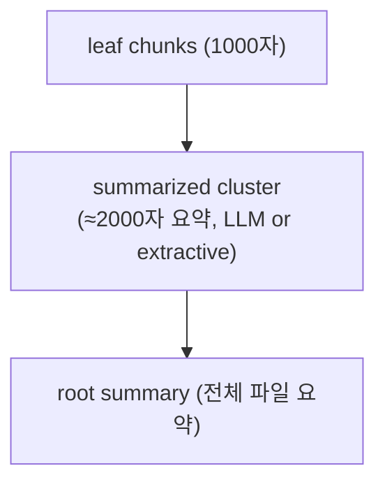
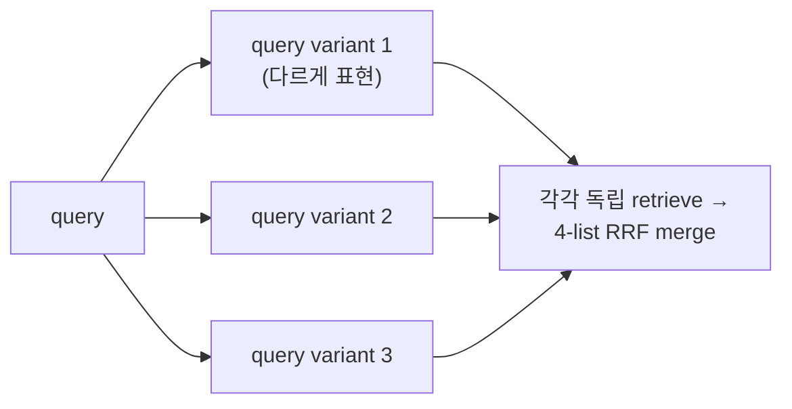
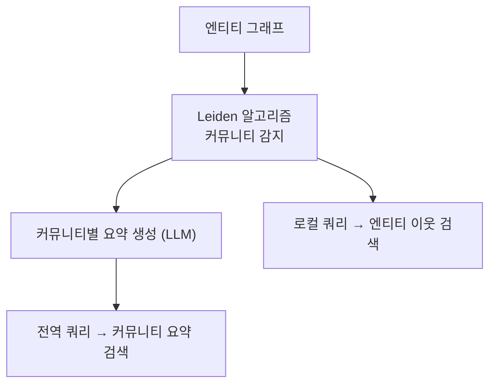
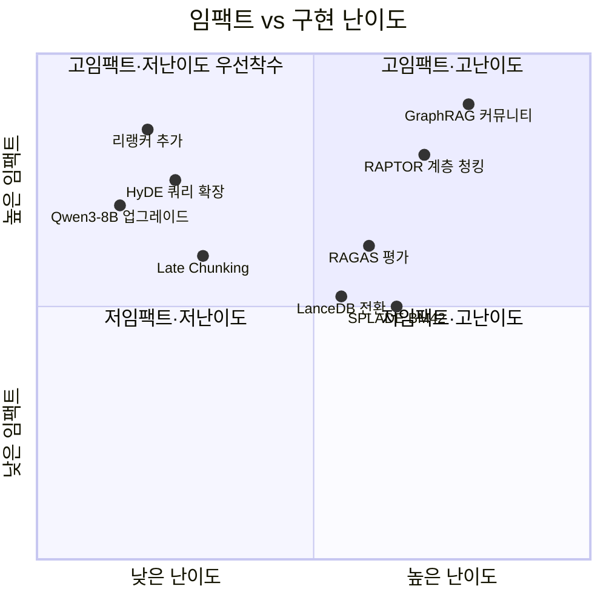

# genome-pocket: 2026 SOTA 기반 기술 개선 분석

> **작성:** jeo creative-thinking-for-research 세션  
> **범위:** 현재 pocketindex 파이프라인 전 계층을 대상으로, 2025-2026 SOTA 논문·모델 기준의 개선 방향을 제안한다.  
> **원칙:** 로컬-퍼스트 / 프라이버시-퍼스트 / 오프라인-가능 DNA를 절대 훼손하지 않는다.

---

## 현재 스택 한눈에 보기

| 계층 | 현재 구현 | 핵심 제약 |
|------|-----------|-----------|
| **청킹** | RecursiveSplitter, 1000자/200자 오버랩 | 고정 크기, 의미 경계 무시 |
| **임베딩** | Qwen3-Embedding-0.6B (단일 벡터/청크) | 소용량, 단일 벡터 표현 |
| **인덱스** | sqlite-vec (brute-force L2) | 대규모 코퍼스에서 O(n) |
| **어휘 검색** | SQLite FTS5 / BM25 | 어휘 미스매치에 취약 |
| **퓨전** | RRF k=60 (정적 가중치) | 쿼리별 최적화 없음 |
| **리랭커** | **없음** | 정밀도 병목 |
| **GraphRAG** | 1-hop 엔티티 앵커 탐색 | 멀티-홉 불가, 커뮤니티 없음 |
| **추출 LLM** | deterministic / Ollama / AirLLM | 소규모 모델 JSON 신뢰도 ≈0% |
| **평가** | 합성 쿼리 + IR 지표 (Hit@k, MRR…) | LLM-judge 없음 |

---

## 개선 영역 1 — 임베딩 모델 업그레이드

### 현황
`Qwen3-Embedding-0.6B` — 단일 벡터, 문서 측 "document" 프롬프트 명시적 사용.

### 2026 SOTA 옵션

| 모델 | MTEB | 파라미터 | 특이점 |
|------|------|---------|--------|
| **Qwen3-Embedding-8B** | #1 (2025.05) | 8B | 0.6B 대비 +6~9 pt, 로컬 실행 가능 |
| **GTE-Qwen3-4B** | #2 | 4B | 균형점, 컨텍스트 32k |
| **NV-Embed-v2** | Top-5 | 7.8B | instruction-tuned, 50개 tasks |
| **Jina Embeddings v3** | Top-5 | 570M | **task별 LoRA 어댑터** — retrieval / STS / classification을 런타임에 전환 |

### 핵심 제안: Late Interaction (ColBERT-style)

단일 벡터 → **청크당 다중 벡터(토큰 수준)** 표현으로 전환.


```text
현재:  chunk → [1 × d] cosine sim
제안:  chunk → [T × d] MaxSim scoring  (ColBERT v2 / ColQwen2.5)
```


**왜 중요한가**: 복잡한 multi-token 쿼리("Python에서 async 함수가 SQLite와 연결되는 방법")에서 단일 벡터는 압축 손실이 크다.  
ColBERT v2 논문은 MS-MARCO에서 단일-벡터 대비 MRR@10 +4.5 pt를 보고한다.

**구현 경로**:
```python
# pocketindex/ops/sentence_transformers.py 에 ColBERT 백엔드 추가
EmbedderBackend(
    name="colbert-late-interaction",
    matches=lambda n: "colbert" in n.lower() or "colqwen" in n.lower(),
    indexer=lambda n: ColBERTEmbedder(n),   # token embeddings → sqlite-vec multi-row
    query_model=lambda n: ColBERTQueryEncoder(n),
)
```


sqlite-vec 는 per-token row를 지원하므로, `embeddings` 테이블에 `token_idx` 컬럼을 추가하고 MaxSim aggregation을 SQL window function으로 구현 가능.

---

## 개선 영역 2 — 청킹 전략

### 현황
`RecursiveSplitter(chunk_size=1000, overlap=200)` — 의미 경계 무시.

### 2026 SOTA 방향

#### A. Late Chunking (JinaAI, arXiv:2409.04701)

기존: 청크 먼저 잘라서 → 각 청크 독립 임베딩
제안: 전체 문서 먼저 인코딩(긴 컨텍스트) → 토큰 표현 풀링으로 청크 벡터 생성

이점: 청크 간 컨텍스트 공유 → 문서 앞 부분 참조가 많은 후반 청크의 임베딩 품질 ↑  
적용: Qwen3-8B-Instruct (128k 컨텍스트) + 토큰 풀링 → 짧은 노트 파일에 즉시 효과.

#### B. RAPTOR (arXiv:2401.18059) — 계층적 청크 트리




장점: 전역(whole-corpus) 쿼리 + 로컬(세부) 쿼리를 같은 인덱스로 처리.  
현재 GraphRAG 1-hop의 "전역 지식" 병목을 대체/보완한다.

**구현 위치**: `pocketindex/ops/text.py`에 `HierarchicalSplitter` 추가,  
`pocket/pipeline.py`의 `process_file` 컴포넌트에서 opt-in(`POCKET_RAPTOR=1`).

#### C. Semantic Splitter
문장 간 임베딩 코사인 유사도 급락 지점에서 분할:
```python
# 기존
chunks = _splitter.split(text, chunk_size=1000, ...)

# 개선 (opt-in)
chunks = SemanticSplitter(
    model=embedder,
    breakpoint_threshold=0.7,   # cosine drop
    min_chunk_size=200,
).split(text)
```


특히 마크다운 노트처럼 주제 전환이 잦은 문서에 효과적.

---

## 개선 영역 3 — 검색 파이프라인

### 현황

```text
query → [BM25 + Vector] → RRF(k=60) → top-K 반환
```


### 3-A. HyDE (Hypothetical Document Embeddings, arXiv:2212.10496)


```text
query → LLM("이 질문에 답하는 문서 단락을 작성하라") → 가상 문서 임베딩
      → 가상 문서 임베딩으로 vector search
```


비대칭 쿼리(짧은 질문 vs. 긴 문서)에서 recall 대폭 향상.  
로컬 Ollama (Qwen3-4B-Instruct, 4비트 양자화 ≈ 2.5GB)로 가능.  
`retrieval.py`의 `_vector_search()` 앞에 선택적 HyDE 패스 추가:

```python
def _vector_search(query: str, conn, *, hyde: bool = False, ...):
    if hyde and _llm_available():
        query = _generate_hypothetical_doc(query)
    ...
```


### 3-B. RAG-Fusion (arXiv:2402.03367)





현재 RRF는 *전략(BM25, vector, graph)* 간 퓨전이지만, RAG-Fusion은 *쿼리 변형* 간 퓨전.  
두 레벨을 함께 쓰면 recall 누적 효과.

구현: `retrieval.routing_trace()` 위에 쿼리 변형 레이어 추가 (Ollama 1-shot 프롬프트).

### 3-C. 크로스-인코더 리랭커 (현재 **완전 누락**)


```text
BM25+Vector+Graph → RRF top-50 후보
                       → Cross-Encoder reranker → 최종 top-K
```


리랭커는 쿼리와 청크를 **함께** 보므로, 단독 임베딩보다 정밀도 급상승.

| 모델 | 크기 | 특이점 |
|------|------|--------|
| **BGE-Reranker-v2-m3** | 568M | 다국어, MTEB reranking #1 |
| **BGE-Reranker-v2-gemma** | 2.5B | 더 높은 정밀도, 약간 느림 |
| **ms-marco-MiniLM-L-12-v2** | 33M | 극히 빠름, 영어 전용 |

구현 포인트:
```python
# pocket/retrieval.py — _rerank() 함수 신설
def _rerank(query: str, hits: list[RetrievalHit], top_k: int) -> list[RetrievalHit]:
    if not config.POCKET_RERANKER:
        return hits[:top_k]
    model = _get_reranker(config.POCKET_RERANKER_MODEL)
    pairs = [(query, h.text) for h in hits]
    scores = model.predict(pairs)
    ...
```


`config.py`에 `POCKET_RERANKER` / `POCKET_RERANKER_MODEL` 추가. 기본 off로 하위 호환 유지.

---

## 개선 영역 4 — GraphRAG 아키텍처

### 현황
1-hop 엔티티 앵커 탐색 → 단일 관계 조회만 가능.

### 4-A. Microsoft GraphRAG 커뮤니티 감지 (arXiv:2404.16130)





현재 시스템은 "local" 쿼리만 지원. "전체 코퍼스의 핵심 주제는?" 같은 전역 쿼리 처리 불가.

구현: `pocketindex/ops/graph_community.py` 신설 — `networkx` + `community` (Leiden) 기반,  
`entities`/`relations` SQLite 테이블로 그래프 구성 → 커뮤니티 테이블 생성.

### 4-B. 멀티-홉 경로 추론 (PathRAG, arXiv:2502.14902)


```text
현재:  query → entity match → 1-hop neighbors → chunk 반환
제안:  query → entity match → BFS/DFS n-hop → 경로 시퀀스 → LLM 종합
```


`retrieval.py`의 `_graph_search()`를 재귀 BFS로 확장:
```python
def _multi_hop_graph_search(query, conn, max_hops=2, ...):
    seeds = _entity_anchor(query, conn)
    paths = _bfs_paths(seeds, conn, max_depth=max_hops)
    return _path_to_context(paths)
```


### 4-C. 구조화된 JSON 출력 신뢰도 향상

graph-target.md가 이미 인용: *"7-9B 모델은 단순 프롬프트로 valid-JSON 0%"*  
(arXiv:2605.02363, arXiv:2604.03616)

**두 패스 전략 (제안)**:

```text
Pass 1: LLM → 자연어 추출 결과 (JSON 강요 없음)
Pass 2: 소형 재포맷터 (Qwen3-0.6B) → 자연어 → 스키마-valid JSON
```


혹은 **grammar-constrained decoding** (llama.cpp GBNF / Outlines 라이브러리):
```python
# 프롬프트 레벨이 아닌 디코딩 레벨에서 JSON 강제
from outlines import generate
json_gen = generate.json(model, ExtractionSchema)
result = json_gen(prompt)   # 100% valid JSON 보장
```


---

## 개선 영역 5 — 인덱스 백엔드 스케일링

### 현황
`sqlite-vec` brute-force 코사인 → 코퍼스 수만 청크 이상에서 쿼리 지연 급증.

### 옵션 비교

| 백엔드 | 특이점 | 적합 규모 | 로컬-퍼스트 |
|--------|--------|----------|------------|
| **sqlite-vec** (현재) | 제로-의존, SQL 내장 | ~10만 청크 | ✅ |
| **LanceDB** (Arrow 기반) | Δ-update, DiskANN ANNS | ~1000만 | ✅ |
| **usearch** (Unum) | FAISS보다 2-5× 빠름, 로컬 | ~100만 | ✅ |
| **DiskANN** | 디스크-상주, 메모리 4GB이하 가동 | 수억 | ✅ |
| **SPLADE v2** | 학습된 희소 임베딩 (BM25 대체) | ~10만 | ✅ |

**권장 마이그레이션 경로**:
1. 현재 sqlite-vec 유지 (소규모 노트)
2. `POCKET_VECTOR_BACKEND=lancedb` 환경 변수로 LanceDB 전환 지원 추가
3. `pocketindex/connectors/sqlite.py` 옆에 `pocketindex/connectors/lancedb.py` 어댑터 신설

LanceDB는 이미 docs/architecture/retrieval-layer.md에 언급되어 있으며 Arrow 포맷 덕에 Δ-only 업데이트가 자연스럽다.

---

## 개선 영역 6 — 어휘 검색: BM42 / SPLADE

### 현황
SQLite FTS5 BM25 — 어휘 미스매치 무방비.

### SPLADE v2 (학습된 희소 벡터)


```text
쿼리 "파이썬 비동기 코드" → BERT 기반 희소 임베딩
  → {'python': 2.1, 'async': 1.8, 'coroutine': 0.9, 'asyncio': 1.2, ...}
```


원래 어휘에 없는 토큰("coroutine", "asyncio")도 자동 팽창 → BM25 어휘 갭 해소.  
로컬 실행 가능 (`naver/splade-v3` HuggingFace).

BM42(Qdrant 제안): 기존 BM25에 IDF만 SPLADE 가중치로 교체 → 의존성 최소.

---

## 개선 영역 7 — 평가 체계 강화

### 현황
합성 쿼리 자동 생성 + IR 지표 (Hit@k, MRR, MAP). LLM judge 없음.

### RAGAS 스타일 4-지표 프레임워크

| 지표 | 정의 | 현재 |
|------|------|------|
| **Faithfulness** | 답변이 검색 컨텍스트에 근거하는가 | ✗ |
| **Answer Relevance** | 답변이 쿼리에 관련있는가 | ✗ |
| **Context Recall** | 정답에 필요한 청크가 검색됐는가 | ✅ (Recall@k로 대체) |
| **Context Precision** | 검색된 청크 중 정말 필요한 비율 | ✅ (Precision@k로 대체) |

**제안**: `pocket/evaluation.py`에 `evaluate_with_judge()` 추가 — Ollama 로컬 LLM이 판정자가 되어 Faithfulness / Answer Relevance를 0–1 스코어로 반환.

```python
# pocket/evaluation.py
@dataclass
class RAGASMetrics:
    faithfulness: float        # 신규
    answer_relevance: float    # 신규
    context_recall: float      # 기존 recall_at_k 매핑
    context_precision: float   # 기존 precision_at_k 매핑
```


---

## 개선 영역 8 — Agentic RAG (Self-RAG / CRAG)

### Self-RAG (arXiv:2310.11511)


```text
LLM이 생성 중 스스로 결정:
  [Retrieve]   → 이 시점에 검색이 필요한가?
  [Relevant]   → 검색된 청크가 관련있는가?
  [Supported]  → 내 생성이 청크에 의해 지지되는가?
  [Useful]     → 최종 답변이 유용한가?
```


MCP 서버 계층 위에 얇은 Self-RAG 게이트를 얹으면, 불필요한 검색 호출을 줄이고 신뢰도 없는 청크 자동 필터링.

### CRAG (Corrective RAG, arXiv:2401.15884)


```text
검색 결과 품질 평가 →
  HIGH:   바로 사용
  LOW:    웹 검색 폴백 (로컬 전용이므로 노트 확장 또는 사용자에게 물어봄)
  AMBIG:  분해 쿼리 재검색
```


현재 `pocket_graph_min_confidence` HITL 게이트와 자연스럽게 통합 가능 — 낮은 신뢰도 엔티티가 pending 되듯이, 낮은 품질 청크는 CRAG 게이트에서 재검색 유도.

---

## 우선순위 매트릭스





### 즉시 착수 가능 (의존성 최소, 하위 호환)

1. **크로스-인코더 리랭커** — `sentence-transformers` 이미 설치됨, `retrieval.py` 50줄
2. **Qwen3-Embedding-8B** — `config.py` 한 줄, `EMBEDDING_MODEL` 교체
3. **HyDE** — Ollama 있으면 `retrieval.py` `_vector_search()` 앞 30줄
4. **Grammar-constrained JSON decoding** — `outlines` 추가, `extract.py` OllamaExtractor 교체

### 중기 (1–3개월, 아키텍처 변경)

5. **RAPTOR 계층 청킹** — `pocketindex/ops/text.py` + pipeline 컴포넌트 추가
6. **GraphRAG 커뮤니티 감지** — `networkx` + `pocketindex/ops/graph_community.py`
7. **LanceDB 벡터 백엔드** — `pocketindex/connectors/lancedb.py` 어댑터
8. **RAGAS-style LLM judge 평가** — `evaluation.py` 확장

### 장기 (cocoindex 마이그레이션 후)

9. **ColBERT Late Interaction** — 스토리지 스키마 변경 필요
10. **멀티-홉 PathRAG** — 그래프 성숙 후
11. **Self-RAG MCP 게이트** — 에이전트 계층 성숙 후

---

## Bisociation: 인접 분야에서 온 아이디어

| 원천 분야 | 핵심 아이디어 | genome-pocket 적용 |
|----------|-------------|-------------------|
| **신경과학** — 해마 재활성화(메모리 공고화) | 수면 중 중요 기억을 선택적 재강화 | `pocket consolidate` — 주기적으로 오래된 청크 요약, 그래프 신뢰도 재계산 |
| **Git 버전 관리** | 브랜치/병합/diff | 지식 그래프의 branch, semantic diff (`pocket diff HEAD~1`) |
| **단백질 구조 예측** — AlphaFold attention | 구조적 관계를 attention으로 | 엔티티 임베딩 학습에 그래프 구조 attention 주입 (GraphSAGE) |
| **추천 시스템** — 콜라보레이티브 필터링 | 사용자 행동에서 선호 학습 | 쿼리 히스토리 → 사용자 개인화 RRF 가중치 학습 |
| **Speculative Decoding** — LLM 추론 가속 | 미래 토큰 미리 추측 | "Speculative Prefetching" — 세션 컨텍스트에서 다음 쿼리 예측, 미리 검색 |

---

## 참고 문헌 (2025-2026)

- ColBERT v2: Khattab & Zaharia 2021, 개선 지속
- Late Chunking: JinaAI arXiv:2409.04701
- RAPTOR: arXiv:2401.18059 (Sarthi et al.)
- HyDE: arXiv:2212.10496 (Gao et al.)
- RAG-Fusion: arXiv:2402.03367
- Microsoft GraphRAG: arXiv:2404.16130
- PathRAG: arXiv:2502.14902
- Self-RAG: arXiv:2310.11511
- CRAG: arXiv:2401.15884
- RAGAS: arXiv:2309.15217
- Format Tax: arXiv:2604.03616 (graph-target.md 이미 인용)
- JSON 신뢰도: arXiv:2605.02363 (graph-target.md 이미 인용)
- Qwen3-Embedding: HuggingFace 2025.05
