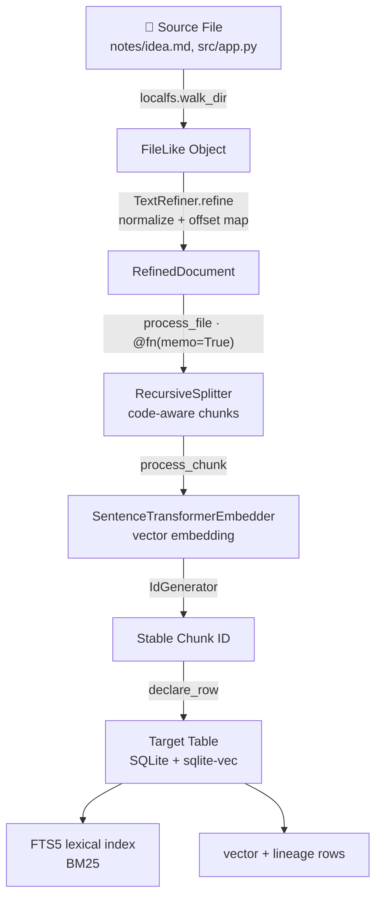

# Declarative Data Flow

This document details the data flow within **Pocket**, illustrating how source files are transformed into target database states using CocoIndex's declarative model.

---

## Data Flow Diagram



### Stage reference

| # | Stage | Component | Input → Output | Incremental behaviour |
|---|-------|-----------|----------------|-----------------------|
| 1 | Source | `localfs.walk_dir` | directory → `FileLike` stream | catch-up scan or live `signature()` watch |
| 1b | Refine | `TextRefiner.refine` | raw bytes → `RefinedDocument` (+ offset map) | deterministic, lineage-preserving |
| 2 | Memoize | `process_file` (`@fn(memo=True)`) | file → skip / reprocess | content + logic fingerprint key |
| 3 | Chunk | `RecursiveSplitter` | text → `Chunk[]` (offsets remapped to source) | code-aware boundaries |
| 4 | Embed | `SentenceTransformerEmbedder` | chunk → vector | re-embeds on model change (folded in fingerprint) |
| 5 | Load | `declare_row` → `TableTarget` | rows → SQLite + `sqlite-vec` + FTS5 | per-row state-diff (`insert`/`replace`/skip) + orphan sweep |

---


## Step-by-Step Execution

### 1. Source Ingestion
Pocket uses the `localfs.walk_dir` connector to scan the source directory. In catch-up mode, it performs a directory scan. In live mode, it registers a file watcher to stream changes in real-time.

### 1b. Refinement (Data Cleaning)
Before chunking, raw text passes through `TextRefiner.refine`, a deterministic cleaning stage: Unicode NFC normalization, CRLF→LF line endings, trailing-whitespace stripping, collapse of duplicate blank lines, and collapse of inline whitespace runs. The refiner returns a `RefinedDocument` carrying an `offset_map`, so every chunk offset computed on the cleaned text is translated back to the **original source byte** — refinement never breaks lineage.

```python
files = localfs.walk_dir(sourcedir, recursive=True, live=True)
await pix.mount_each(process_file, files.items(), target_table)
```

### 2. File Processing & Memoization
The `process_file` function is decorated with `@pix.fn(memo=True)`. When a file is scanned, CocoIndex computes a hash of the file content and the function's code. If the hash matches a previously processed state, the function is skipped, avoiding redundant chunking and embedding.

```python
@pix.fn(memo=True)
async def process_file(file: FileLike, table: postgres.TableTarget[DocEmbedding]) -> None:
    text = await file.read_text()
    chunks = _splitter.split(text, chunk_size=2000, chunk_overlap=500)
    id_gen = IdGenerator()
    await pix.map(process_chunk, chunks, file.file_path.path, id_gen, table)
```

### 3. Chunking & Embedding
If a file has changed, it is split into chunks using `RecursiveSplitter`. For each chunk, we generate a stable ID using `IdGenerator` and compute its vector embedding using the local embedder.

```python
@pix.fn
async def process_chunk(
    chunk: Chunk, filename: pathlib.PurePath,
    id_gen: IdGenerator, table: postgres.TableTarget[DocEmbedding],
) -> None:
    table.declare_row(row=DocEmbedding(
        id=await id_gen.next_id(chunk.text),
        filename=str(filename),
        chunk_start=chunk.start.char_offset,
        chunk_end=chunk.end.char_offset,
        text=chunk.text,
        embedding=await pix.use_context(EMBEDDER).embed(chunk.text),
    ))
```

### 4. Target State Declaration
The `table.declare_row` call registers the desired state of the row in the target database. CocoIndex compares the declared rows with the actual database state:
- **New Chunks:** Inserted into the database.
- **Modified Chunks:** Updated in the database.
- **Deleted Chunks:** Automatically removed from the database when their parent file is deleted or modified (since they are no longer declared).
