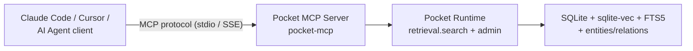

# Model Context Protocol (MCP) Integration

This document describes how **Pocket** exposes its personal knowledge base to AI agents (like Claude Code, Cursor, or custom agents) using the Model Context Protocol (MCP).

---

## MCP Architecture

Pocket runs a local MCP server that communicates with the host agent via standard input/output (stdio) or SSE (Server-Sent Events).



| Tool | Purpose | Backing call |
|------|---------|--------------|
| `search_knowledge` | hybrid retrieval over notes/code | `retrieval.search` |
| `get_file_lineage` | indexing history for a file | lineage tables |
| `list_concepts` | browse the knowledge graph | `retrieval.list_graph_concepts` (`POCKET_GRAPH=1`) |


---

## Exposed Tools

The Pocket MCP server exposes the following tools to the AI agent:

### 1. `search_knowledge`
- **Description:** Search the personal knowledge base using hybrid search (lexical + semantic).
- **Parameters:**
  - `query` (string, required): The search query.
  - `limit` (integer, optional): Maximum number of results to return (default: 5).
- **Returns:** A list of matching chunks, each containing the text and its source lineage.

### 2. `get_file_lineage`
- **Description:** Retrieve the indexing history and lineage details for a specific source file.
- **Parameters:**
  - `file_path` (string, required): The path to the source file.
- **Returns:** The file's hash, last processed timestamp, and list of generated chunk IDs.

### 3. `list_concepts`
- **Description:** List key concepts and relationships extracted from the knowledge graph.
- **Parameters:**
  - `concept` (string, optional): Filter by concept name.
- **Returns:** A list of nodes and edges representing the conceptual relationships.

---

## Configuration

To configure Claude Code or Cursor to use the Pocket MCP server, add the following to the agent's configuration file (e.g., `mcp_config.json`):

```json
{
  "mcpServers": {
    "pocket": {
      "command": "uv",
      "args": ["run", "--package", "genome-pocket", "pocket-mcp"]

    }
  }
}
```
