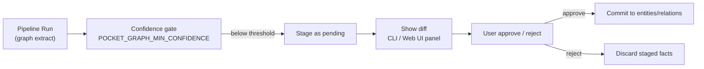

# Ops Layer: Evaluation, Tracing & Human-in-the-Loop

This document outlines the design of the **Ops Layer** in Pocket, focusing on system reliability, explainability, and human-in-the-loop (HITL) validation.

---

## Tracing & Lineage

To ensure complete explainability, Pocket tracks the execution of every pipeline component and retrieval query.

### 1. Component Tracing
CocoIndex automatically tracks the execution history of all `@pix.fn` components. Pocket exposes this data to help developers diagnose pipeline failures:
- **Execution Logs:** Track which files were processed, skipped (memoized), or failed.
- **Dependency Graph:** Visualize the parent-child relationships between components (e.g., `process_file` -> `process_chunk`).

### 2. Retrieval Lineage
Every retrieved chunk returned to an AI agent contains a `lineage` metadata block:
```json
{
  "text": "Pocket is a local-first personal Knowledge Ops runtime...",
  "lineage": {
    "source_file": "notes/architecture.md",
    "char_start": 120,
    "char_end": 340,
    "source_hash": "a1b2c3d4..."
  }
}
```
This allows the agent to cite its sources precisely and lets the user click through to the exact line in their editor.

---

## Evaluation Framework

To prevent retrieval quality regressions, Pocket includes a lightweight local evaluation suite:

- **Synthetic Case Generation:** `synthesize_cases` mines the *existing index* — deterministically, with no LLM — joining each file's most distinctive tokens (lowest cross-file document frequency) into a self-labeled query whose only correct answer is that file.
- **Retrieval Metrics:** Measures **Hit@k**, **Precision@k**, **Recall@k**, **MRR**, and **MAP@k** against the same `retrieval.search` path real queries take.
- **Regression Guard:** `pocket eval --baseline <json> --tolerance` exits non-zero when any metric drops below a saved baseline — drop-in for CI. Optional `--with-judge` adds RAGAS-style Faithfulness/Relevance via a local Ollama model.


---

## Human-in-the-Loop (HITL) Approval

For sensitive operations or complex graph updates, Pocket introduces an interactive approval gate:




### Implementation Pattern
Using a local CLI prompt or a web UI, Pocket pauses execution and displays a diff of the proposed changes:
- **Sensitive Files:** If a file marked as `private` is about to be indexed or sent to an external API, the system requests confirmation.
- **Graph Schema Changes:** If the pipeline extracts a new relationship type (e.g., `User` -> `knows` -> `User`), the user must approve the schema update.
