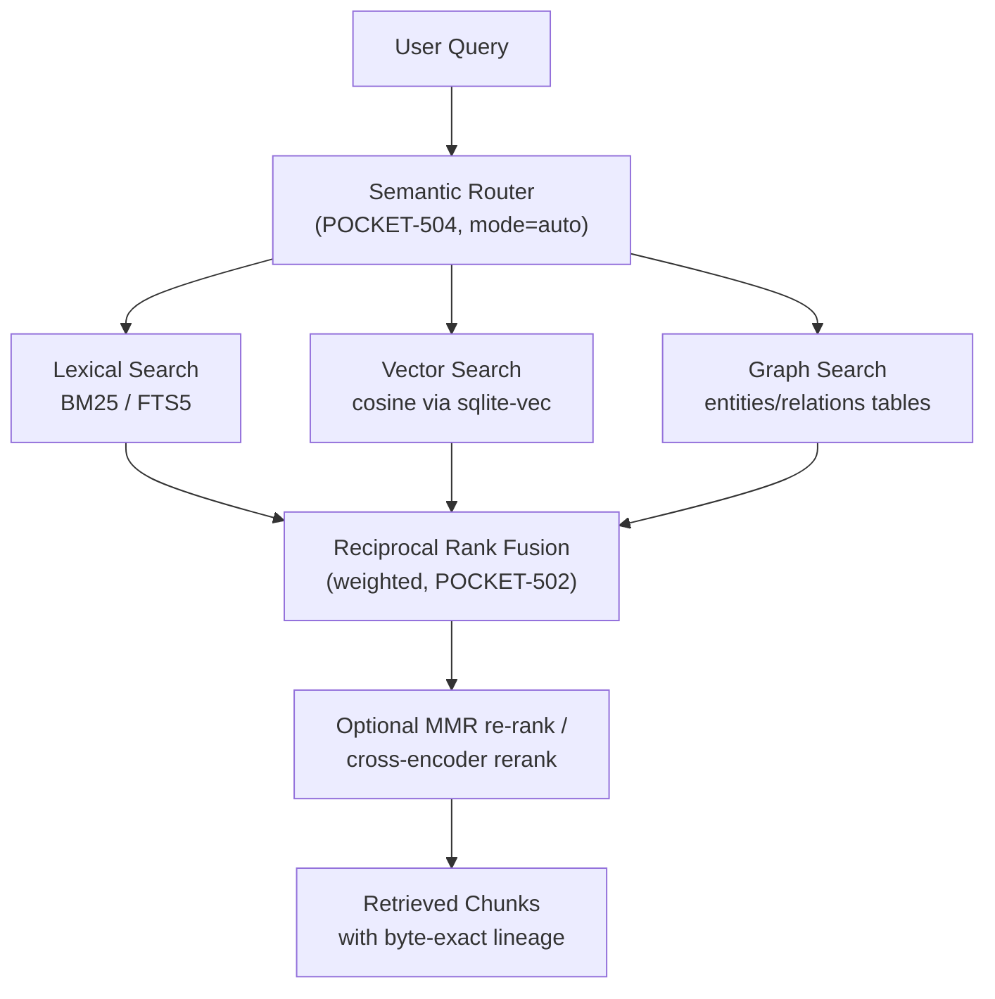

# Retrieval Layer

This document describes the design of the **Retrieval Layer** in Pocket, which combines lexical, semantic, and graph-based search to provide highly relevant context to AI agents.

---

## Hybrid Retrieval Architecture

To achieve high-quality retrieval, Pocket combines three distinct search strategies:

| Strategy | Best for | Backend | Toggle |
|----------|----------|---------|--------|
| **Lexical** (BM25/FTS5) | exact keywords, symbols, error codes | SQLite FTS5 | `--mode lexical` |
| **Vector** (cosine) | conceptual meaning, synonyms | `sqlite-vec` | `--mode vector` |
| **Graph** (multi-hop) | relationships between concepts | `entities`/`relations` SQLite tables | `--mode graph` |
| **Hybrid** (default) | balanced recall + precision | RRF over the above | `--mode hybrid` |
| **Auto** | pick mode from query shape | semantic router | `--mode auto` |

---

## Search Strategies

### 1. Lexical Search (BM25 / SQLite FTS5)
- **Purpose:** Matches exact keywords, names, error codes, or specific symbols.
- **Implementation:** Uses SQLite's Full-Text Search (FTS5) extension or BM25 indexing on the chunk text.

### 2. Vector Search (Semantic)
- **Purpose:** Matches conceptual meaning and synonyms, even when exact keywords differ.
- **Implementation:** Uses `sqlite-vec` cosine similarity over the chunk embeddings (LanceDB is a planned alternative target for very large corpora, POCKET-606).

### 3. Graph Search (Conceptual Relationships)
- **Purpose:** Traverses relationships between concepts (e.g., `Project A` -> `depends on` -> `Library B`).
- **Implementation:** Multi-hop traversal over the local `entities`/`relations` SQLite tables populated by the opt-in GraphRAG branch (`pocket update --graph`).

---

## Semantic Routing

Not all queries benefit from all search strategies. Pocket implements a lightweight **Semantic Router** to classify the query intent:

- **Code/Symbol Queries:** Routed primarily to Lexical Search (e.g., searching for `def process_chunk`).
- **Conceptual/Open-ended Queries:** Routed primarily to Vector Search (e.g., searching for `how does incremental sync work`).
- **Relational/Structural Queries:** Routed to Graph Search (e.g., searching for `what projects are affected by changing the database schema`).

---

## Reciprocal Rank Fusion (RRF)

When multiple search strategies are used, their results are combined using **Reciprocal Rank Fusion (RRF)**. RRF scores each document based on its rank in each individual search result, ensuring that documents appearing high in multiple lists are ranked highest in the final output.

$$\text{RRF Score}(d) = \sum_{m \in M} \frac{1}{k + r_m(d)}$$

Where:
- $M$ is the set of search strategies.
- $r_m(d)$ is the rank of document $d$ in strategy $m$.
- $k$ is a constant (typically 60).

---

## Automated Evaluation & Regression Guard (POCKET-303)

Retrieval quality is measurable, not aspirational. `pocket/evaluation.py` (driven
by `pocket eval`) scores the live pipeline so a change to chunk size, embedding
model, or fusion weights that quietly hurts recall fails loudly instead.

**Metrics.** Standard information-retrieval scores, computed as pure functions
over a ranked list of retrieved file paths versus a set of relevant ones:
Hit@k, Reciprocal Rank (→ MRR), Precision@k, Recall@k, and Average Precision
(→ MAP). Path matching is lenient (exact, path-suffix, or basename) so a gold
set written with relative paths still matches an index of absolute paths.

**Cases.** Two sources:

- **Synthetic query/context pairs** (`synthesize_cases`) mine the *existing
  index*: for each source file, the tokens most *distinctive* to it (lowest
  cross-file document frequency, then length) are joined into a self-labeled
  query whose only correct answer is that file. No hand-curated gold set is
  needed, and any indexing/chunking regression becomes a dropped hit. These
  default to `lexical` mode — a deterministic probe of the BM25 index that does
  not depend on which embedding model is installed.
- **Hand-written gold cases** loaded from JSON (`--cases`), each
  `{query, relevant_files[, mode]}`, validated on load.

**Run & gate.** `evaluate()` runs every case through the same
`retrieval.search()` real queries use (honoring each case's `mode`), so the
harness can never diverge from production. `save_baseline()` records a run's
aggregate metrics; `compare_to_baseline()` (with a `--tolerance` to absorb
noise) flags any metric that fell below the baseline, and `pocket eval
--baseline <json>` exits non-zero on a regression — ready to drop into CI.
