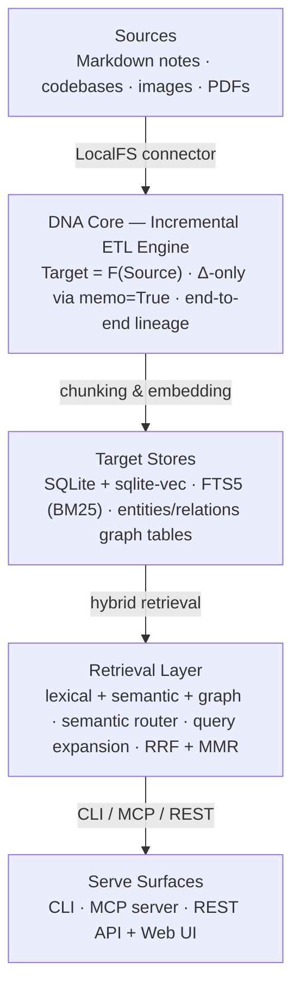

# Pocket System Overview & DNA Core

This document describes the high-level architecture of **Pocket** and how it implements the core "DNA" of CocoIndex to deliver a local-first, privacy-preserving personal Knowledge Ops runtime.

---

## High-Level Architecture

Pocket is structured into five layers, running entirely on the user's local machine:

| Layer | Responsibility | Current implementation | Planned alternatives |
|-------|----------------|------------------------|----------------------|
| **Sources** | Watch local content | `pocketindex/connectors/localfs.py` (markdown, code, images) | API/bookmark connectors |
| **DNA Core** | Incremental `Target = F(Source)` ETL | `pocketindex/` engine (fingerprint memo, state-diff, deletion sweep) | native `cocoindex` runtime (P8 PoC) |
| **Target Stores** | Persist vectors, lexical index, graph | SQLite + `sqlite-vec` + FTS5 + `entities`/`relations` tables | LanceDB (POCKET-606), external pgvector/graph |
| **Retrieval** | Fuse strategies into ranked context | `pocket/retrieval.py` (router, expansion, RRF, optional MMR/reranker/HyDE) | — |
| **Serve** | Expose to humans & agents | CLI, `pocket-mcp`, `pocket serve` (REST + Web UI) | SSE transport |

---

## The DNA Core: Core Mental Model

The "DNA" of Pocket is inherited directly from CocoIndex's core design principles:

### 1. Declarative Mapping (`Target = F(Source)`)
Instead of writing complex, imperative pipelines with manual error handling and state tracking, Pocket developers declare what the target database should look like based on the current source files. 

For example, we declare that for every file in `./notes`, there should be a set of rows in our vector database. The CocoIndex engine guarantees that the database will always match this declaration, handling insertions, updates, and deletions automatically.

### 2. Delta-Only (Δ) Incremental Processing
Processing large personal knowledge bases (especially with local embedding models or LLMs) can be slow and resource-intensive. Pocket uses CocoIndex's fine-grained invalidation:
- **File-level caching:** If a file has not changed (based on its hash), its processing function is skipped entirely (`memo=True`).
- **Code-aware caching:** If the transformation code (e.g., the chunking logic or embedding model) changes, the engine detects the code hash change and reprocesses only the affected components.

### 3. End-to-End Lineage
Every chunk stored in the target database is tagged with its source file path, character offsets, and source hash. This enables complete explainability: when an AI agent retrieves a chunk, it can trace it back to the exact source byte, allowing the user to verify the context.

### 4. Local-First & Privacy
Since personal notes, code, and documents contain sensitive information, Pocket is designed to run entirely locally. It defaults to local embedding models (via `sentence-transformers`) and local databases (SQLite/LanceDB), ensuring no data leaves the user's machine unless explicitly configured.
